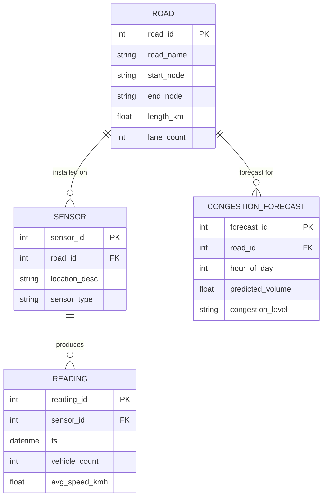

# ER Model — Smart City Traffic Sensor System (DBMS Unit 1)

## Entities & Attributes

| Entity | Key Attributes |
|---|---|
| **Road** | road_id (PK), road_name, start_node, end_node, length_km, lane_count |
| **Sensor** | sensor_id (PK), road_id (FK), location_desc, sensor_type, installed_on |
| **Reading** | reading_id (PK), sensor_id (FK), ts, vehicle_count, avg_speed_kmh |
| **CongestionForecast** | forecast_id (PK), road_id (FK), hour_of_day, predicted_volume, congestion_level |

## Relationships

- **Road (1) — Sensor (N)**: a road can have multiple sensors along it.
- **Sensor (1) — Reading (N)**: each sensor emits many timestamped readings.
- **Road (1) — CongestionForecast (N)**: each road gets one forecast row per hour-of-day (24 max).

## Normalization note (for viva)
- `Reading` is kept in 3NF: every non-key attribute (`vehicle_count`, `avg_speed_kmh`) depends only on the whole key (`reading_id`), not on `sensor_id` alone — sensor metadata lives only in `Sensor`, avoiding update anomalies.
- `congestion_forecast` has a `UNIQUE(road_id, hour_of_day)` constraint instead of composing it into the key, so the Python job can *upsert* a fresh prediction each run without duplicate rows.
